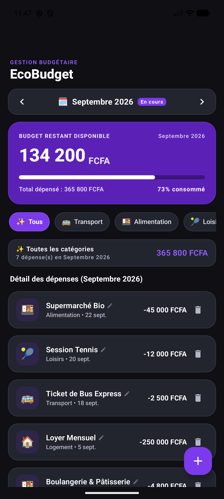
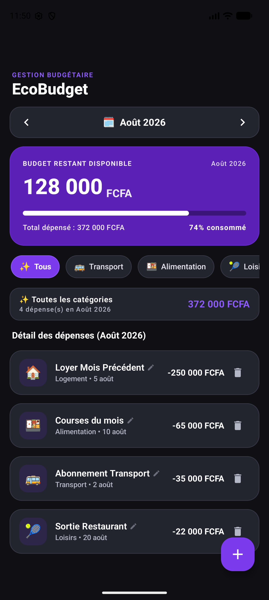
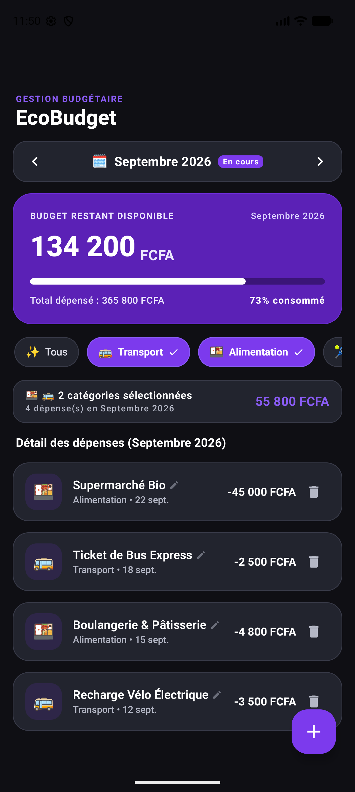
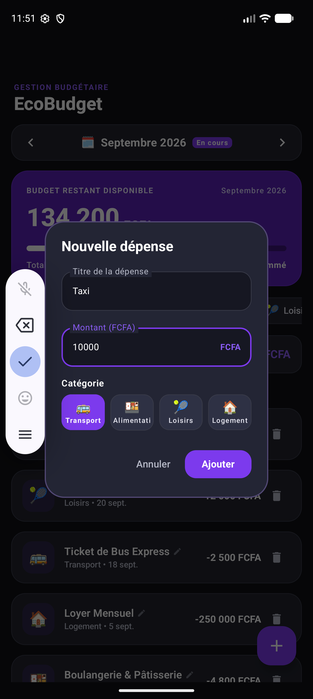
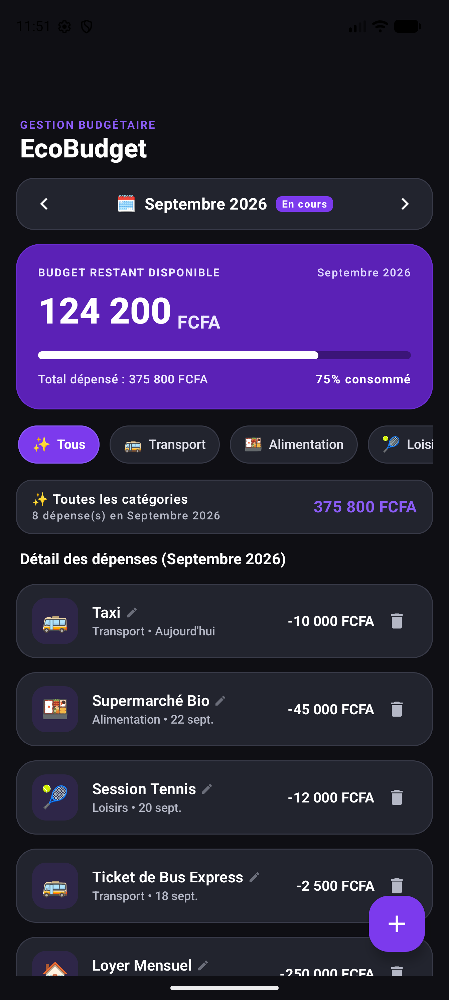

# EcoBudget 🌿 — Migration vers Kotlin Multiplatform

**UE Développement mobile avancé — Année académique 2025-2026**
Document technique de synthèse : migration du prototype Android natif d'EcoBudget vers une architecture
**Kotlin Multiplatform (KMP)** + **Compose Multiplatform (CMP)**.

---

## Sommaire

1. [Résultat en bref](#1-résultat-en-bref)
2. [Architecture cible](#2-architecture-cible)
3. [Configuration Gradle du module partagé](#3-configuration-gradle-du-module-partagé)
4. [Analyse fichier par fichier des migrations vers `commonMain`](#4-analyse-fichier-par-fichier-des-migrations-vers-commonmain)
5. [Problèmes transverses rencontrés](#5-problèmes-transverses-rencontrés)
6. [Validation fonctionnelle](#6-validation-fonctionnelle)
7. [Historique des commits](#7-historique-des-commits)
8. [Compiler et exécuter le projet](#8-compiler-et-exécuter-le-projet)
9. [Limites connues](#9-limites-connues)

---

## 1. Résultat en bref

| Élément | État |
|---|---|
| Module `:shared` KMP ciblant **Android** + **iOS** (`iosX64`, `iosArm64`, `iosSimulatorArm64`) | ✅ |
| Modèles (`Transaction`, `Category`, `YearMonth`) dans `commonMain`, **zéro import `java.*` / `android.*`** | ✅ |
| `TransactionRepository`, `FakeTransactionRepository`, `EcoBudgetUiState`, `EcoBudgetViewModel` dans `commonMain` | ✅ |
| Libellés servis par le catalogue partagé `composeResources` (`Res.string.*`) | ✅ |
| `:shared:compileCommonMainKotlinMetadata` (compilation du code commun seul) | ✅ sans erreur |
| `:app:assembleDebug` | ✅ sans avertissement du compilateur Kotlin |
| Tests unitaires communs (`commonTest`) | ✅ 13/13 |
| Exécution sur émulateur Android (tableau de bord, calculs, navigation, filtres, ajout/édition/suppression) | ✅ aucune régression |

Vérification de la neutralité du code commun :

```bash
$ grep -rnE "import (java|javax|android)\." shared/src/commonMain
# (aucun résultat)
```

---

## 2. Architecture cible

```
EcoBudget/
├── app/                                   ← Application Android native (UI Jetpack Compose)
│   └── src/main/java/com/example/
│       ├── MainActivity.kt                ← obtient le ViewModel partagé via sa Factory
│       └── ui/ (components, screens, theme)  ← consomme Res.string.* du module partagé
│
└── shared/                                ← Module Kotlin Multiplatform
    └── src/
        ├── commonMain/
        │   ├── kotlin/com/example/
        │   │   ├── model/                 Transaction, Category, YearMonth
        │   │   ├── data/repository/       TransactionRepository, FakeTransactionRepository
        │   │   └── viewmodel/             EcoBudgetUiState, EcoBudgetViewModel, CategoryLabels
        │   └── composeResources/values/   strings.xml (catalogue de libellés partagé)
        └── commonTest/kotlin/com/example/ YearMonthTest, EcoBudgetViewModelTest
```

Les **noms de packages Kotlin ont été conservés** (`com.example.model`, `com.example.data.repository`,
`com.example.viewmodel`) : l'interface Android continue d'importer les mêmes symboles, seul leur module
d'origine change. Cela limite la migration côté `:app` au strict nécessaire (ressources + fabrique du ViewModel).

Le flux de dépendances est unidirectionnel : `:app` → `:shared`. Le module partagé ne connaît rien de
l'application Android (ni `Activity`, ni `Context`, ni classe `R`).

---

## 3. Configuration Gradle du module partagé

### 3.1 Catalogue de versions (`gradle/libs.versions.toml`)

| Ajout | Version | Rôle |
|---|---|---|
| plugin `org.jetbrains.kotlin.multiplatform` | 2.1.21 (= `kotlin`) | Compilation multi-cibles |
| plugin `com.android.library` | 8.10.1 (= `agp`) | Cible Android du module partagé (AAR) |
| plugin `org.jetbrains.compose` | 1.7.3 | Compose Multiplatform + génération de la classe `Res` |
| `org.jetbrains.kotlinx:kotlinx-datetime` | 0.6.2 | Remplace `java.util.Calendar`, `Date`, `SimpleDateFormat`, `System.currentTimeMillis()` |
| `org.jetbrains.androidx.lifecycle:lifecycle-viewmodel` | 2.8.4 | `ViewModel` + `viewModelScope` multiplateformes |
| `org.jetbrains.kotlin:kotlin-test` | 2.1.21 | Assertions pour `commonTest` |
| `kotlin` / `googleDevtoolsKsp` | 2.0.21 → **2.1.21** / 2.0.21-1.0.28 → **2.1.21-2.0.1** | Voir [§5.1](#51-kotlin-2021-incapable-de-lire-les-klib-des-dépendances) |

### 3.2 `build.gradle.kts` racine

Les trois nouveaux plugins sont déclarés avec `apply false` : ils sont chargés **une seule fois** dans le
classpath de build puis appliqués par les modules qui en ont besoin (évite les conflits de classloader entre
`:app` et `:shared`).

### 3.3 `settings.gradle.kts`

```kotlin
include(":app")
include(":shared")
```

### 3.4 `shared/build.gradle.kts` (extraits commentés)

```kotlin
plugins {
  alias(libs.plugins.kotlin.multiplatform)
  alias(libs.plugins.android.library)
  alias(libs.plugins.compose.multiplatform)
  alias(libs.plugins.kotlin.compose)       // compilateur Compose, obligatoire avec CMP depuis Kotlin 2.0
}

kotlin {
  androidTarget { compilerOptions { jvmTarget.set(JvmTarget.JVM_17) } }   // aligné sur :app
  listOf(iosX64(), iosArm64(), iosSimulatorArm64()).forEach {
    it.binaries.framework { baseName = "Shared"; isStatic = true }       // framework consommable par Xcode
  }
  sourceSets {
    all { languageSettings.optIn("kotlin.uuid.ExperimentalUuidApi") }
    commonMain.dependencies {
      api(compose.runtime)
      api(compose.components.resources)
      api(libs.kotlinx.coroutines.core)
      api(libs.jetbrains.lifecycle.viewmodel)
      implementation(libs.kotlinx.datetime)
    }
    androidMain.dependencies { implementation(libs.kotlinx.coroutines.android) }
    commonTest.dependencies { implementation(libs.kotlin.test); implementation(libs.kotlinx.coroutines.test) }
  }
}

compose.resources {
  publicResClass = true                              // Res visible depuis :app
  packageOfResClass = "com.example.shared.resources"
  generateResClass = always
}
```

**Choix `api` / `implementation`** : `Flow`, `ViewModel`, `StringResource` et `stringResource()`
apparaissent dans l'API publique du module (type de retour du dépôt, super-classe du ViewModel, type de
`Category.labelRes`). Ils sont donc exposés en `api` pour que `:app` compile sans redéclarer ces
dépendances. `kotlinx-datetime` n'apparaît dans aucune signature publique et reste en `implementation`.

**`lifecycle-viewmodel` déclaré explicitement** : il arrive déjà de façon transitive
(`components-resources → compose.ui → lifecycle-viewmodel`, vérifié avec `:shared:dependencies`). Il reste
déclaré explicitement pour ne pas dépendre d'un chemin transitif susceptible de disparaître.

### 3.5 Liaison avec le module applicatif (`app/build.gradle.kts`)

```kotlin
implementation(project(":shared"))
```

Côté `MainActivity`, le ViewModel partagé est obtenu par sa **fabrique multiplateforme** :

```kotlin
private val viewModel: EcoBudgetViewModel by viewModels { EcoBudgetViewModel.Factory }
```

### 3.6 `gradle.properties`

```properties
kotlin.native.ignoreDisabledTargets=true
```

Les cibles iOS ne peuvent être compilées en binaire que sur macOS. Sur Windows et Linux, cette propriété
évite l'avertissement « targets are disabled on this host » sans désactiver les cibles, qui restent déclarées
et prêtes pour une compilation sur Mac.

---

## 4. Analyse fichier par fichier des migrations vers `commonMain`

**Méthode suivie** : chaque fichier a d'abord été déplacé **sans modification** dans
`shared/src/commonMain`, puis compilé seul avec `./gradlew :shared:compileCommonMainKotlinMetadata`.
Cette tâche compile le code commun **sans aucune plateforme** : toute API propre à la JVM ou à Android y est
introuvable. Les erreurs citées ci-dessous sont les **sorties réelles du compilateur** (Kotlin 2.1.21).

---

### 4.1 `model/Transaction.kt`

| | |
|---|---|
| **Problème rencontré** | **Aucun.** Le fichier a compilé tel quel dans `commonMain`. |
| **Analyse** | La `data class` n'utilise que des types de la bibliothèque standard Kotlin (`String`, `Double`, `Long`) et l'enum `Category`. La date est stockée en `Long` (millisecondes epoch), une représentation neutre qui ne dépend pas de `java.util.Date`. |
| **Choix technique** | Déplacement pur (`git mv`, historique conservé). |
| **Justification** | Les types `kotlin.*` de base sont implémentés nativement sur chaque cible (JVM, Kotlin/Native pour iOS). Garder un `Long` plutôt qu'un type date évite en plus d'imposer une bibliothèque de dates aux consommateurs du modèle. |

---

### 4.2 `model/Category.kt`

**Problème rencontré** : l'enum portait un identifiant de ressource Android.

```kotlin
import com.example.R                                  // ← classe générée par AGP pour le module :app
enum class Category(val labelResId: Int, val emoji: String) {
    TRANSPORT(R.string.category_transport, "🚌"), ...
```

```
e: shared/src/commonMain/kotlin/com/example/model/Category.kt:3:20 Unresolved reference 'R'.
e: shared/src/commonMain/kotlin/com/example/model/Category.kt:12:15 Unresolved reference 'R'.
e: shared/src/commonMain/kotlin/com/example/model/Category.kt:13:18 Unresolved reference 'R'.
e: shared/src/commonMain/kotlin/com/example/model/Category.kt:14:13 Unresolved reference 'R'.
e: shared/src/commonMain/kotlin/com/example/model/Category.kt:15:14 Unresolved reference 'R'.
```

La classe `R` est générée par le plugin Android **dans le module `:app`**. Elle n'existe ni sur iOS, ni dans
le code commun. Un `Int` d'identifiant de ressource n'a de toute façon de sens que pour le système de
ressources Android.

**Choix technique appliqué** (en deux temps) :

1. L'entité du domaine est **purifiée** : elle ne garde que ce qui est intrinsèque à la catégorie.
   ```kotlin
   enum class Category(val emoji: String) { TRANSPORT("🚌"), ALIMENTATION("🍱"), LOISIRS("🎾"), LOGEMENT("🏠") }
   ```
2. Le libellé est résolu par une **propriété d'extension** placée dans la couche présentation partagée
   (`viewmodel/CategoryLabels.kt`), qui pointe vers le catalogue de ressources multiplateforme :
   ```kotlin
   val Category.labelRes: StringResource
       get() = when (this) {
           Category.TRANSPORT -> Res.string.category_transport
           ...
       }
   ```
   Dans l'UI, `stringResource(category.labelResId)` devient `stringResource(category.labelRes)`.

   *(Pendant l'étape 2, pour que chaque commit reste compilable, une extension provisoire
   `Category.labelResId` vers `R.string` a vécu dans `:app`. Elle a été supprimée à l'étape 5.)*

**Justification** :
- **Neutralité du domaine** : `Category` ne dépend plus d'aucune bibliothèque, pas même de Compose.
  Le domaine reste réutilisable (serveur, CLI, tests) et le couplage aux ressources vit dans la présentation,
  qui est sa place.
- **Compatibilité Android et iOS** : `StringResource` (Compose Multiplatform Resources) est un type commun.
  Sur Android, le texte est lu dans les *assets* de l'APK. Sur iOS, il est lu dans le bundle du framework.
- Le `when` exhaustif sur l'enum est vérifié à la compilation : une nouvelle catégorie sans libellé est
  détectée immédiatement.

---

### 4.3 `model/YearMonth.kt`

**Problème rencontré** : le calcul et le formatage des dates reposaient entièrement sur les API JVM.

```kotlin
import java.text.SimpleDateFormat
import java.util.Calendar
import java.util.Date
import java.util.Locale
...
val sdf = SimpleDateFormat("MMMM yyyy", Locale.FRENCH)
formatted.replaceFirstChar { if (it.isLowerCase()) it.titlecase(Locale.FRENCH) else it.toString() }
```

Erreurs du compilateur (extrait des 26 erreurs) :

```
e: .../model/YearMonth.kt:3:8   Unresolved reference 'java'.
e: .../model/YearMonth.kt:4:8   Unresolved reference 'java'.
e: .../model/YearMonth.kt:5:8   Unresolved reference 'java'.
e: .../model/YearMonth.kt:6:8   Unresolved reference 'java'.
e: .../model/YearMonth.kt:23:23 Unresolved reference 'Calendar'.
e: .../model/YearMonth.kt:27:23 Unresolved reference 'SimpleDateFormat'.
e: .../model/YearMonth.kt:27:53 Unresolved reference 'Locale'.
e: .../model/YearMonth.kt:28:40 Unresolved reference 'Date'.
e: .../model/YearMonth.kt:29:84 Too many arguments for 'fun Char.titlecase(): String'.
e: .../model/YearMonth.kt:70:24 Argument type mismatch: actual type is 'MatchGroup?', but 'Int' was expected.
```

Deux erreurs méritent une explication :
- `Too many arguments for 'fun Char.titlecase(): String'` : la surcharge `titlecase(Locale)` n'existe que sur
  la JVM. En commun, seule la version sans argument existe.
- `actual type is 'MatchGroup?'` : sans `java.util.Calendar`, l'expression `cal.get(Calendar.YEAR)` a été
  résolue par le compilateur vers une autre fonction `get` de la stdlib. C'est une erreur **en cascade** de
  l'import manquant.

**Choix technique appliqué** : bibliothèque officielle **`kotlinx-datetime`** + table des mois en français.

| API JVM d'origine | Remplacement commun |
|---|---|
| `Calendar.getInstance()` (instant présent) | `Clock.System.now()` |
| `cal.timeInMillis = ts` puis `get(YEAR/MONTH)` | `Instant.fromEpochMilliseconds(ts).toLocalDateTime(TimeZone.currentSystemDefault())` |
| `cal.set(YEAR, MONTH, DAY, HOUR…)` + `timeInMillis` | `LocalDateTime(y, m + 1, d, h, 0).toInstant(tz).toEpochMilliseconds()`, encapsulé dans la nouvelle méthode `timestampAt(day, hour)` |
| `SimpleDateFormat("MMMM yyyy", Locale.FRENCH)` + `titlecase(Locale)` | `"${FRENCH_MONTH_NAMES[month]} $year"` avec une liste de 12 noms déjà capitalisés |
| arithmétique de mois implicite (`set(MONTH, m + offset)` accepte les débordements) | nouvelle méthode `plusMonths(offset)` (division euclidienne `floorDiv` / `mod`) |

Le **contrat public est préservé** : `month` reste indexé de 0 à 11, et `previous()`, `next()`,
`containsTimestamp()`, `current()`, `fromTimestamp()` et `displayLabel` gardent leur signature et leur
comportement (« Août 2026 »). `containsTimestamp` s'appuie désormais sur `fromTimestamp` (une seule
conversion à maintenir).

**Justification** :
- `kotlinx-datetime` est la bibliothèque de dates multiplateforme maintenue par JetBrains. Elle délègue à
  `java.time` sur Android/JVM et à `Foundation` (`NSTimeZone`) sur iOS. On garde donc la gestion correcte des
  fuseaux horaires et de l'heure d'été sur les deux plateformes.
- La **table des mois** remplace `SimpleDateFormat`, qui n'a pas d'équivalent commun. `kotlinx-datetime`
  0.6 ne propose pas de noms de mois localisés, et un `expect/actual` (`SimpleDateFormat` sur Android,
  `NSDateFormatter` sur iOS) aurait ajouté deux implémentations pour un besoin figé : l'application est
  intégralement en français, montants en FCFA compris. Le résultat est identique et déterministe
  (il ne dépend plus des données de locale du système), et `YearMonthTest` le vérifie.
- `plusMonths` / `timestampAt` sont du **Kotlin pur** : testables sur toutes les cibles, et réutilisés par le
  dépôt et par le ViewModel au lieu de dupliquer la logique `Calendar`.

---

### 4.4 `data/repository/TransactionRepository.kt`

| | |
|---|---|
| **Problème rencontré** | **Aucun.** Compilation directe. |
| **Analyse** | Le contrat n'utilise que `kotlinx.coroutines.flow.Flow` et des fonctions `suspend`. Ce sont deux mécanismes nativement multiplateformes : les coroutines font partie du langage, et `kotlinx-coroutines-core` publie des artefacts pour JVM, iOS, JS, etc. |
| **Choix technique** | Déplacement pur ; `kotlinx-coroutines-core` exposé en `api` dans `commonMain`. |
| **Justification** | Le dépôt « réactif » (`Flow`) et « asynchrone » (`suspend`) prévu dès l'origine est exactement le contrat recommandé en KMP. Sur iOS, ces API restent consommables depuis Swift (fonctions `suspend` exposées en `async`/completion handlers par Kotlin/Native). |

---

### 4.5 `data/repository/FakeTransactionRepository.kt`

**Problème rencontré** : génération des dates de test via `Calendar` et des identifiants via `UUID`.

```kotlin
import java.util.Calendar
import java.util.UUID
...
cal.set(Calendar.MONTH, currentMonth + monthOffset)   // débordement de mois géré par Calendar (mode lenient)
id = UUID.randomUUID().toString()
```

```
e: .../FakeTransactionRepository.kt:9:8   Unresolved reference 'java'.
e: .../FakeTransactionRepository.kt:10:8  Unresolved reference 'java'.
e: .../FakeTransactionRepository.kt:23:24 Unresolved reference 'Calendar'.
   ... (Calendar : 11 occurrences)
e: .../FakeTransactionRepository.kt:35:21 Unresolved reference 'UUID'.
   ... (UUID : 13 occurrences, une par transaction)
```

**Choix technique appliqué** :

```kotlin
val currentMonth = YearMonth.current()
fun getTimeForMonth(monthOffset: Int, day: Int, hour: Int): Long =
    currentMonth.plusMonths(monthOffset).timestampAt(day, hour)
...
id = Uuid.random().toString()          // kotlin.uuid.Uuid
```

- `java.util.Calendar` → les méthodes communes `YearMonth.plusMonths()` / `timestampAt()` créées en §4.3.
  Le passage d'année (mois -1 en janvier, +1 en décembre), géré implicitement par le mode *lenient* de
  `Calendar`, est désormais **explicite et testé** (`plusMonthsHandlesYearBoundariesInBothDirections`).
- `java.util.UUID` → **`kotlin.uuid.Uuid`** de la bibliothèque standard (Kotlin ≥ 2.0.20), activé par
  `languageSettings.optIn("kotlin.uuid.ExperimentalUuidApi")` dans le script Gradle.

**Justification** :
- `kotlin.uuid.Uuid.random()` produit un UUID v4 au même format texte que `java.util.UUID`
  (`xxxxxxxx-xxxx-4xxx-…`). Il s'appuie sur le générateur aléatoire sécurisé de chaque plateforme
  (`SecureRandom` sur JVM, `arc4random` sur Apple). Aucune dépendance tierce n'est nécessaire.
- L'API est marquée *expérimentale* (susceptible d'évoluer). L'opt-in est posé **une fois, au niveau du
  module**, pour ne pas disperser des `@OptIn` dans le code. Alternatives écartées : la bibliothèque
  `benasher44:uuid` (dépendance tierce inutile) ou un `expect fun randomId()` (deux implémentations pour un
  besoin couvert par la stdlib).
- Le jeu de données produit est **strictement identique** à l'original (13 transactions, mêmes montants,
  mêmes jours et heures), ce que vérifient les tests du ViewModel.

---

### 4.6 `viewmodel/EcoBudgetUiState.kt` *(extrait de `EcoBudgetViewModel.kt`)*

| | |
|---|---|
| **Problème rencontré** | Aucune erreur propre : la classe n'utilise que des types du domaine et de la stdlib (`coerceIn`, `Category.entries`). Elle était cependant déclarée dans le même fichier que le ViewModel. |
| **Choix technique** | Extraction dans un fichier dédié de `commonMain`, contenu inchangé. |
| **Justification** | L'état d'interface est une `data class` **immuable** : pas de mutabilité partagée entre threads, donc aucune contrainte liée au modèle mémoire de Kotlin/Native. Un fichier dédié rend le contrat d'état lisible pour les équipes Android et iOS (côté Swift, l'état est observé et les propriétés calculées `budgetUsageRatio`, `isAllCategoriesSelected`… sont partagées au lieu d'être réécrites). |

---

### 4.7 `viewmodel/EcoBudgetViewModel.kt`

**Problème rencontré** : horodatage, construction de date et génération d'identifiant JVM dans
`saveTransaction()`.

```kotlin
import java.util.Calendar
import java.util.UUID
...
System.currentTimeMillis()
val cal = Calendar.getInstance(); cal.set(Calendar.YEAR, …); … cal.timeInMillis
id = UUID.randomUUID().toString()
```

```
e: .../EcoBudgetViewModel.kt:16:8   Unresolved reference 'java'.
e: .../EcoBudgetViewModel.kt:17:8   Unresolved reference 'java'.
e: .../EcoBudgetViewModel.kt:233:21 Unresolved reference 'System'.
e: .../EcoBudgetViewModel.kt:235:31 Unresolved reference 'Calendar'.
   ... (Calendar : 5 occurrences)
e: .../EcoBudgetViewModel.kt:244:26 Unresolved reference 'UUID'.
```

**Point notable** : `androidx.lifecycle.ViewModel`, `androidx.lifecycle.viewModelScope` et tous les
opérateurs de flux (`MutableStateFlow`, `combine`, `stateIn`, `SharingStarted.WhileSubscribed`) n'ont
produit **aucune erreur**. Depuis la version 2.8, la bibliothèque Lifecycle publie ces classes dans le code
commun, **sous le même package `androidx.lifecycle`**. La chaîne réactive d'origine est donc portable sans
réécriture.

**Choix techniques appliqués** :

| Élément | Remplacement | Commentaire |
|---|---|---|
| `System.currentTimeMillis()` | `Clock.System.now().toEpochMilliseconds()` | kotlinx-datetime |
| `Calendar` (15 du mois à 12 h) | `currentYearMonth.timestampAt(day = 15, hour = 12)` | même comportement qu'avant, sans duplication |
| `UUID.randomUUID()` | `Uuid.random()` | stdlib, cf. §4.5 |
| Super-classe `ViewModel` | inchangée, fournie par `org.jetbrains.androidx.lifecycle:lifecycle-viewmodel:2.8.4` | variante KMP publiée par JetBrains pour Compose Multiplatform. Sur Android, elle se résout vers l'artefact `androidx.lifecycle` officiel (métadonnées Gradle), donc aucun doublon de classe |
| Instanciation | ajout d'une **fabrique commune** `EcoBudgetViewModel.Factory` (`viewModelFactory { initializer { … } }`) | voir ci-dessous |

**Gestion du cycle de vie et de la chaîne réactive** :

- `viewModelScope` est lié à `ViewModel.onCleared()` sur toutes les plateformes. Les coroutines lancées
  (`saveTransaction`, `deleteTransaction`) et le partage `stateIn(viewModelScope, WhileSubscribed(5_000), …)`
  sont annulés à la destruction du ViewModel, comme avant.
- `viewModelScope` s'exécute sur `Dispatchers.Main.immediate`. Sur Android, ce dispatcher est fourni par
  `kotlinx-coroutines-android` (déclaré en `androidMain`). Sur iOS, `kotlinx-coroutines-core` le fournit
  nativement (file principale `dispatch_get_main_queue`).
- `WhileSubscribed(5_000)` est conservé : la souscription au dépôt survit 5 s après le dernier abonné, ce qui
  couvre une rotation d'écran Android (recréation de l'Activity) sans recalcul. Sur iOS, l'arrêt de
  l'observation d'un écran libère la souscription après ce même délai.
- Côté Android, l'UI continue de collecter l'état avec `collectAsStateWithLifecycle()`, qui suspend la
  collecte quand l'Activity passe en arrière-plan.

**Pourquoi une `Factory`** : auparavant, `by viewModels()` instanciait le ViewModel **par réflexion Java**
(constructeur sans argument synthétisé par Kotlin grâce à la valeur par défaut du paramètre). Ce mécanisme
n'existe pas sur Kotlin/Native. La fabrique `viewModelFactory { initializer { … } }` appartient à l'API
commune de Lifecycle : **Android et iOS obtiennent le ViewModel de la même manière**, et l'injection du
dépôt devient explicite.

**Justification globale** : aucune logique métier du ViewModel n'a été réécrite, seules trois primitives JVM
ont été remplacées. Les tests de `EcoBudgetViewModelTest` (exécutés sur le code commun) prouvent que les
calculs sont identiques.

---

### 4.8 Catalogue de ressources : `composeResources/values/strings.xml`

**Problème rencontré** : les 37 libellés étaient des ressources Android (`app/src/main/res/values/strings.xml`),
accessibles uniquement par `R.string.*` et `androidx.compose.ui.res.stringResource`, deux API propres à
Android. Le déplacement du fichier a aussi révélé trois **incompatibilités de format** avec Compose
Multiplatform Resources 1.7.3, confirmées en inspectant le bytecode de la bibliothèque
(`StringResourcesUtilsKt` : expression régulière de substitution `%(\d)\$[ds]`) :

| Syntaxe Android d'origine | Comportement avec CMP 1.7.3 | Correction |
|---|---|---|
| `%s`, `%d` (non positionnels) | non substitués, affichés tels quels | `%1$s`, `%1$d` |
| `%%` (pourcentage échappé) | non interprété, afficherait `73%% consommé` | `%` simple : `%1$d% consommé` |
| `\'` (apostrophe échappée) | seuls `\n` et `\t` font l'objet d'un traitement explicite dans le générateur | apostrophe écrite directement : `Aujourd'hui` (valide en XML) |

Chaînes concernées : `total_spent_format`, `budget_usage_percent_format`, `transactions_detail_title_format`,
`empty_expenses_month_format`, `empty_expenses_filtered_format`, `content_desc_delete_format`, `date_today`,
`empty_expenses_hint`.

**Choix technique appliqué** : **Compose Multiplatform Resources** (`org.jetbrains.compose.components:components-resources`).

- Fichier déplacé vers `shared/src/commonMain/composeResources/values/strings.xml`.
- Le plugin génère une classe **`Res` publique** (`com.example.shared.resources.Res`) avec un accesseur typé
  par clé (`Res.string.app_name`…).
- Dans les 4 fichiers d'UI (`EcoBudgetScreen`, `TransactionCard`, `MonthNavigatorBar`, `AddTransactionDialog`) :
  - `import androidx.compose.ui.res.stringResource` → `import org.jetbrains.compose.resources.stringResource`
  - `import com.example.R` → `import com.example.shared.resources.*`
  - `R.string.xxx` → `Res.string.xxx` (la signature `stringResource(res, vararg args)` est identique)
- `app/src/main/res/values/strings.xml` ne conserve **que `app_name`** : `AndroidManifest.xml`
  (`android:label="@string/app_name"`) ne peut référencer qu'une ressource Android native.

**Justification** :
- Une **source unique** pour les libellés : une correction ou une traduction (`values-en/strings.xml`) dans
  le module partagé s'applique aux deux plateformes.
- **Accès typé** vérifié à la compilation : une clé supprimée provoque une erreur de compilation, et non un
  plantage à l'exécution.
- Empaquetage natif par plateforme : sur Android, le catalogue est intégré à l'APK
  (vérifié : `assets/composeResources/com.example.shared.resources/values/strings.commonMain.cvr`) ;
  sur iOS, il est copié dans le bundle du framework.
- La résolution suit la langue du système sur chaque plateforme, comme les ressources Android.

---

## 5. Problèmes transverses rencontrés

### 5.1 Kotlin 2.0.21 incapable de lire les KLIB des dépendances

Première compilation de `commonMain` avec la version d'origine du projet (Kotlin 2.0.21) :

```
e: KLIB resolver: Could not find ".../kotlinTransformedMetadataLibraries/commonMain/
   org.jetbrains.kotlinx-kotlinx-coroutines-core-1.10.2-concurrentMain-wJOvIw.klib"
```

Le fichier existait bien sur le disque. **Cause** : le projet initial utilisait déjà
`kotlinx-coroutines 1.10.2`, compilé avec Kotlin 2.1 et qui tire `kotlin-stdlib 2.1.0`. Sur Android pur (JVM),
le compilateur 2.0 lit ces classes sans difficulté. En revanche, les **KLIB** (format de bibliothèque du code
commun et natif) produites par un compilateur plus récent sont rejetées par le résolveur 2.0.21, qui les
signale comme « introuvables ». KMP a donc révélé une incohérence de versions jusque-là invisible.

**Solution** : alignement du compilateur sur les bibliothèques, **Kotlin 2.1.21** (+ KSP `2.1.21-2.0.1`,
dont la version est liée à celle de Kotlin). Rétrograder les coroutines aurait été possible, mais aurait
modifié une dépendance fonctionnelle de l'application.

Bénéfice annexe : KGP 2.0.21 n'était testé qu'avec AGP ≤ 8.5 et émettait un avertissement de compatibilité
avec l'AGP 8.10.1 du projet. Cet avertissement disparaît avec KGP 2.1.21, sans propriété de suppression.

### 5.2 Avertissements traités

| Avertissement | Traitement |
|---|---|
| `Experimental API in the Kotlin Gradle Plugin` (`androidTarget { compilerOptions }`) | `@OptIn(ExperimentalKotlinGradlePluginApi::class)` explicite |
| Cibles iOS désactivées sur un hôte Windows | `kotlin.native.ignoreDisabledTargets=true` (voir §3.6) |
| `shared/build` et `.vscode` non ignorés | `shared/.gitignore`, `.gitignore` |

Avertissement restant, **non bloquant** : `Provider.forUseAtConfigurationTime has been deprecated`
(dépréciation Gradle 9). La trace d'exécution montre qu'il est émis **par le plugin Compose Multiplatform
1.7.3 lui-même** (`org.jetbrains.compose.resources.ComposeResourcesKt.onKgpApplied`), et non par les
scripts du projet. Il disparaîtra avec une mise à jour du plugin et n'a aucun effet sur Gradle 8.12.

---

## 6. Validation fonctionnelle

### 6.1 Tests unitaires du code commun (`commonTest`)

Commande : `./gradlew :shared:testDebugUnitTest` → **13 tests, 0 échec**.

| Classe | Scénarios vérifiés |
|---|---|
| `YearMonthTest` (5) | `previous()` janvier → décembre N-1 ; `next()` décembre → janvier N+1 ; `plusMonths(-13 / +14)` ; libellés « Août 2026 », « Janvier 2025 », « Décembre 2024 » ; `timestampAt` / `containsTimestamp` / `fromTimestamp` cohérents |
| `EcoBudgetViewModelTest` (8) | **Tableau de bord** : 7 dépenses, total 365 800, reste 134 200, 73 % · **Navigation** : M-1 = 372 000 (4 dépenses), M+1 = 270 000, M+2 vide (reste 500 000), retour au mois courant · **Filtres** : Alimentation = 49 800, + Transport = 55 800, retrait = 6 000, « Tous » · sélection des 4 catégories ≡ « Tous » · **CRUD** : ajout (titre nettoyé par `trim`), édition, suppression · dépense ajoutée en naviguant sur M-1 datée dans M-1 · saisie invalide ignorée · 13 identifiants uniques |

Les tests remplacent `Dispatchers.Main` par un `UnconfinedTestDispatcher` (`kotlinx-coroutines-test`),
ce qui démontre au passage que le ViewModel est testable sans Android.

### 6.2 Exécution sur émulateur Android

Émulateur `Pixel_10_Pro_XL` (x86_64), APK `app-debug.apk`. Les valeurs ci-dessous ont été relevées à l'écran
via `uiautomator dump`. Le journal `logcat -b crash` n'a remonté **aucun plantage**.

| Scénario | Résultat observé |
|---|---|
| Tableau de bord (Septembre 2026, « En cours ») | Reste **134 200 FCFA**, « Total dépensé : 365 800 FCFA », « **73% consommé** », 7 dépenses |
| ◀ Mois précédent | « Août 2026 », 128 000 restant, 372 000 dépensés, 74 %, 4 dépenses |
| ▶▶ Mois suivant | « Octobre 2026 », 230 000 restant, 270 000 dépensés, 54 %, 2 dépenses |
| Clic sur le libellé du mois | retour à « Septembre 2026 · En cours » |
| Filtre Alimentation | « 🍱 Alimentation », 2 dépenses, **49 800 FCFA** (la carte Hero garde 365 800) |
| + Transport | « 🍱 🚌 2 catégories sélectionnées », 4 dépenses, **55 800 FCFA** |
| « Tous » | « ✨ Toutes les catégories », 7 dépenses |
| Ajout « Taxi », 10 000, Transport | carte « Transport • Aujourd'hui », total 375 800, 75 % |
| Édition → 20 000 | total 385 800, 77 % |
| Suppression | retour à 365 800 / 73 % |

| Tableau de bord | Mois précédent | Filtre multi-catégories | Ajout | Après ajout |
|---|---|---|---|---|
|  |  |  |  |  |

Ces valeurs sont **identiques** à celles de l'application d'origine (même jeu de données, mêmes formules),
et les tests unitaires les figent.

---

## 7. Historique des commits

| # | Commit | Contenu |
|---|---|---|
| 0 | Import du projet initial EcoBudget (Android natif) | état de départ, branche `master` du dépôt enseignant |
| 1 | Étape 1 : création et configuration du module KMP shared | plugins, cibles Android/iOS, dépendances, liaison `:app → :shared` |
| 2 | Étape 2 : migration de la couche Domaine (model) | `Transaction`, `Category`, `YearMonth` ; Kotlin 2.1.21 |
| 3 | Étape 3 : migration de la couche Données | `TransactionRepository`, `FakeTransactionRepository` |
| 4 | Étape 4 : migration de la couche Présentation | `EcoBudgetUiState`, `EcoBudgetViewModel`, `Factory` |
| 5 | Étape 5 : centralisation des libellés | `composeResources`, `Res.string`, `Category.labelRes` |
| 6 | Étape 6 : tests de non-régression | `commonTest` (13 tests) |
| 7 | Étape 7 : document technique de synthèse | ce README + captures d'écran |

Chaque commit compile (`:app:assembleDebug`) : la migration est progressive et peut être rejouée pas à pas
(`git log --stat`, `git show <commit>`).

---

## 8. Compiler et exécuter le projet

Prérequis : JDK 17 ou 21, Android SDK (plateforme 35), un émulateur ou un appareil Android 7.0+ (API 24).

```bash
# Compilation du code commun seul (vérifie l'absence d'API JVM/Android dans commonMain)
./gradlew :shared:compileCommonMainKotlinMetadata

# Tests unitaires du module partagé
./gradlew :shared:testDebugUnitTest

# APK Android puis installation sur l'émulateur/appareil connecté
./gradlew :app:assembleDebug
./gradlew :app:installDebug
```

Framework iOS (sur macOS avec Xcode uniquement) :

```bash
./gradlew :shared:linkDebugFrameworkIosSimulatorArm64    # → shared/build/bin/iosSimulatorArm64/debugFramework/Shared.framework
```

---

## 9. Limites connues

- **Cibles iOS non compilées** : le travail a été réalisé sous Windows, où Kotlin/Native ne peut pas produire
  de binaires Apple. Les cibles sont déclarées et le code commun est validé par
  `compileCommonMainKotlinMetadata` (compilation sans aucune API de plateforme). La génération effective du
  framework `Shared` reste à faire sur macOS, et aucune application iOS (projet Xcode) n'était demandée.
- **Interface graphique restée dans `:app`** : conformément au cahier des charges, seuls le modèle, les données,
  l'état, le ViewModel et les libellés ont été mutualisés. Les composables Jetpack Compose utilisent encore
  `java.text.NumberFormat` / `SimpleDateFormat` pour le formatage des montants et des dates, ce qui est
  légitime dans un module Android. Une étape suivante consisterait à déplacer ces écrans dans `commonMain`
  (Compose Multiplatform) avec un formateur commun.
- **Test Robolectric préexistant** (`app/src/test/.../ExampleRobolectricTest`) : il échoue sur la machine de
  développement avec `Unable to load Robolectric native runtime library`. L'échec est **identique sur le
  commit initial non modifié** (vérifié dans un *worktree* séparé) : il vient de l'environnement Windows
  (bibliothèque native de Robolectric), pas de la migration. `ExampleUnitTest` passe.
